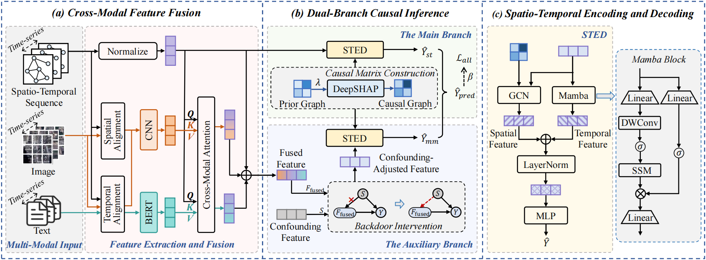

# Causal Spatio-Temporal Prediction: An Effective and Efficient Multi-Modal Approach

Spatio-temporal prediction plays a crucial role in intelligent transportation, weather forecasting, and urban planning. 

While integrating multi-modal data has shown potential for enhancing prediction accuracy, key challenges persist: (i) inadequate fusion of multi-modal information, (ii) confounding factors that obscure causal relations, and (iii) high computational complexity of prediction models. To address these challenges, we propose E2-CSTP, an **E**ffective and **E**fficient **C**ausal multi-modal **S**patio-**T**emporal **P**rediction framework. E2-CSTP leverages cross-modal attention and gating mechanisms to effectively integrate multi-modal data. Building on this, we design a dual-branch causal inference approach: the primary branch focuses on spatio-temporal prediction, while the auxiliary branch mitigates bias by modeling additional modalities and applying causal interventions to uncover true causal dependencies. To improve model efficiency, we integrate GCN with the Mamba architecture for accelerated spatio-temporal encoding. 

Extensive experiments on 4 real-world datasets show that E2-CSTP significantly outperforms 9 state-of-the-art methods, achieving up to 9.66% improvements in accuracy as well as 17.37%-56.11% reductions in computational overhead.

## Environment
- Python.version = 3.8.20
- PyTorch.version = 2.0.1
- Other dependencies are listed in `requirements.txt`.

## Base BERT model
In this experiment, we use the [BERT](https://huggingface.co/google-bert/bert-base-uncased/tree/main) model. Please place the downloaded model in the `./models` folder.

## Datasets
We use four public datasets, [Terra](https://huggingface.co/datasets/onedean/Terra), [BjTT](https://chyazhang.github.io/BjTT/), [GreenEarthNet](https://github.com/vitusbenson/greenearthnet) and [BikeNYC](https://github.com/XueruiSu/BikeNYC-Flow-Prediction/tree/main/BikeNYC%E6%B5%81%E9%87%8F%E9%A2%84%E6%B5%8B%E4%BB%A3%E7%A0%81/BikeNYC). Please download the original dataset and place it in the `./datasets` folder.

